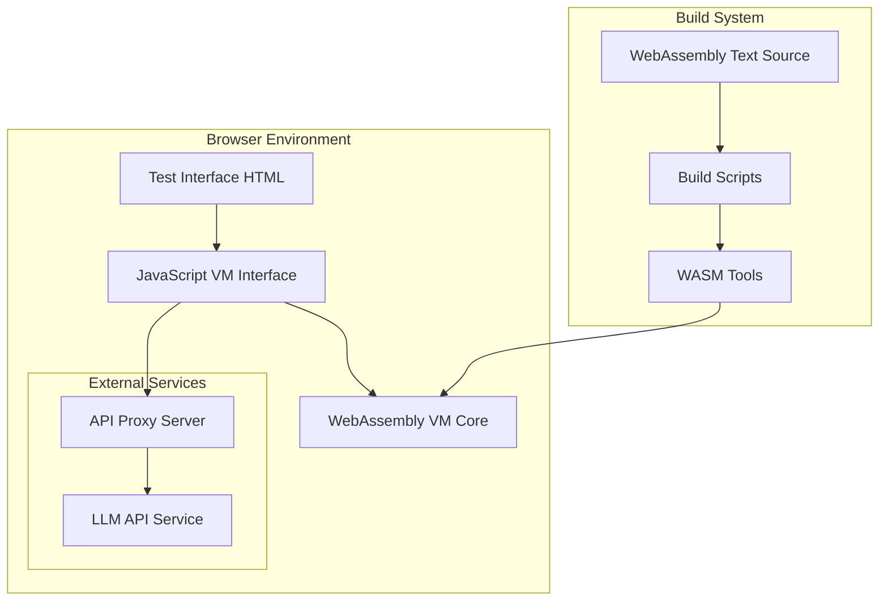
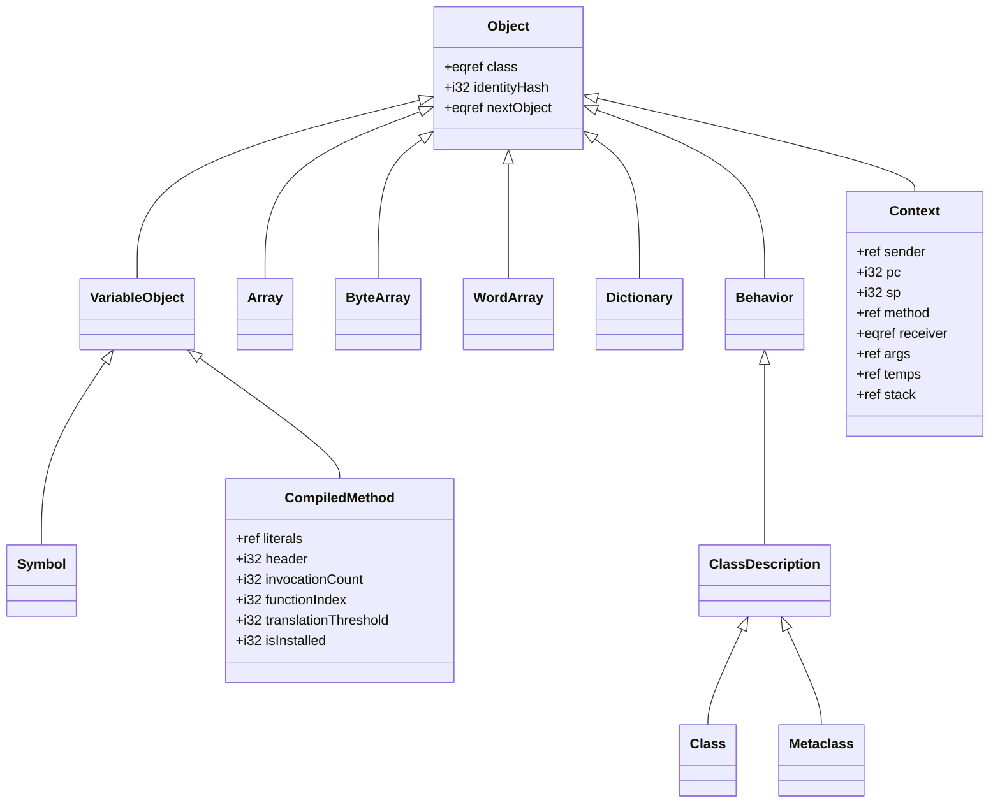
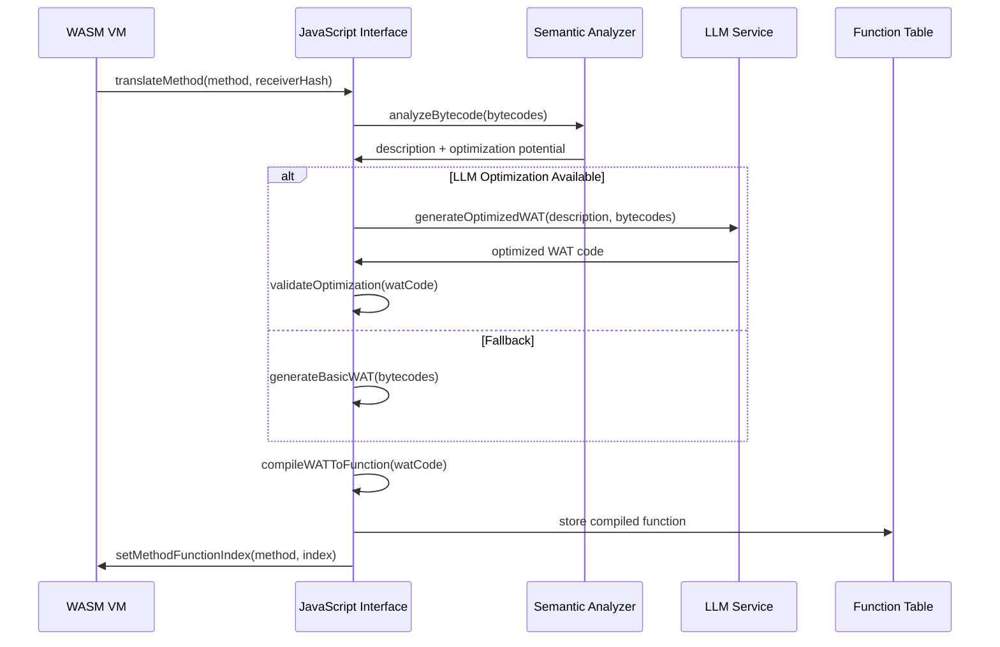

# Design Document

## Overview

Catalyst is a sophisticated WebAssembly-based Smalltalk virtual machine that implements dynamic method translation with AI-assisted optimization. The system operates in web browsers using WebAssembly GC features and provides runtime performance optimization by translating frequently-executed Smalltalk bytecode to optimized WebAssembly functions.

The architecture follows a hybrid interpretation/compilation model where methods start as interpreted bytecode and are automatically promoted to compiled WebAssembly functions when they become "hot" (frequently executed). This approach provides immediate execution capability while optimizing performance-critical code paths.

## Architecture

### High-Level System Architecture



### Core VM Architecture

The VM implements a three-tier execution model:

1. **Interpretation Layer**: Direct bytecode execution for immediate functionality
2. **Translation Layer**: Dynamic conversion of hot methods to WebAssembly
3. **Optimization Layer**: AI-assisted semantic analysis and code generation

### Memory Management

The system uses WebAssembly GC for automatic memory management with a structured object hierarchy:

- **Object Types**: Defined using WebAssembly struct types with inheritance
- **Reference Types**: All Smalltalk objects use `eqref` as common supertype
- **SmallInteger**: Optimized using WebAssembly's `i31` reference type
- **Collections**: Specialized array types for different data kinds

## Components and Interfaces

### 1. WebAssembly VM Core (`catalyst.wat`)

**Purpose**: Core virtual machine implementation in WebAssembly Text format

**Key Responsibilities**:
- Smalltalk object model implementation
- Bytecode interpretation engine
- Method invocation and context management
- Memory allocation and garbage collection
- Function table management for translated methods

**Key Types**:
```wat
(type $VirtualMachine (struct ...))
(type $CompiledMethod (struct ...))
(type $Context (struct ...))
(type $Object (struct ...))
```

**Exported Functions**:
- `initialize()`: VM initialization
- `interpret()`: Main bytecode interpreter
- `translateMethod()`: Method translation trigger
- Memory access functions for JavaScript interop

### 2. JavaScript VM Interface (`catalyst.js`)

**Purpose**: Bridge between WebAssembly VM and browser environment

**Key Responsibilities**:
- WASM module loading and initialization
- Method translation orchestration
- Performance monitoring and statistics
- LLM integration for optimization
- Bytecode analysis and semantic understanding

**Core Classes**:
```javascript
class SqueakVM {
    // VM lifecycle management
    initialize()
    run()
    resetVM()
    
    // Method translation pipeline
    translateMethodToWASM()
    translateMethodToWAT()
    compileWATToFunction()
    
    // Semantic analysis
    analyzeAndOptimize()
    generateOptimizedWATWithLLM()
    validateOptimization()
}
```

### 3. Build System (`build.js`)

**Purpose**: Compilation and deployment pipeline

**Key Responsibilities**:
- WAT to WASM compilation using `wasm-tools`
- File copying and distribution preparation
- WASM module validation and analysis
- Development server configuration

### 4. Test Interface (`test.html`)

**Purpose**: Interactive testing and demonstration environment

**Key Features**:
- Method translation demonstration
- Performance benchmarking
- Statistics visualization
- Configuration controls

### 5. LLM Integration System

**Purpose**: AI-assisted method optimization

**Components**:
- **API Proxy Server** (`api-proxy.js`): Secure API key management
- **Semantic Analyzer**: Bytecode pattern recognition
- **Optimization Engine**: WAT code generation with LLM assistance
- **Validation System**: Correctness verification of optimized code

## Data Models

### Smalltalk Object Hierarchy



### Method Translation Data Flow



### Performance Monitoring Model

```javascript
const stats = {
    totalInvocations: 0,
    translations: 0,
    cachedMethods: 0,
    executionTime: 0,
    optimizedMethods: 0,
    translationValidationsPassed: 0,
    translationValidationsFailed: 0,
    llmAttempts: 0,
    llmSuccesses: 0
}
```

## Error Handling

### Translation Error Recovery

The system implements a multi-level fallback strategy:

1. **LLM Optimization Failure**: Fall back to basic WAT generation
2. **WAT Compilation Failure**: Continue with bytecode interpretation
3. **Validation Failure**: Retry with improved prompts, then fall back
4. **Runtime Errors**: Graceful degradation to interpretation mode

### Error Categories

- **Compilation Errors**: WAT syntax or semantic errors
- **Validation Errors**: Generated code produces incorrect results
- **Runtime Errors**: Execution failures in translated methods
- **Network Errors**: LLM service unavailability

### Error Reporting

```javascript
// Structured error reporting with context
{
    type: 'translation_error',
    phase: 'wat_compilation',
    method: methodReference,
    bytecodes: [...],
    error: errorDetails,
    fallbackUsed: true
}
```

## Testing Strategy

### Unit Testing Approach

1. **Bytecode Interpretation Tests**: Verify correct execution of individual bytecode instructions
2. **Translation Correctness Tests**: Ensure translated methods produce identical results to interpreted versions
3. **Performance Regression Tests**: Monitor translation overhead and execution speedup
4. **LLM Integration Tests**: Validate AI-assisted optimization pipeline

### Integration Testing

1. **End-to-End Workflow Tests**: Complete method translation pipeline
2. **Multi-System Tests**: Concurrent VM instances
3. **Browser Compatibility Tests**: Cross-browser WebAssembly GC support
4. **Performance Benchmarking**: Systematic performance measurement

### Test Data Management

- **Bytecode Test Cases**: Comprehensive instruction coverage
- **Method Examples**: Real-world Smalltalk method patterns
- **Performance Baselines**: Reference execution times
- **Validation Datasets**: Expected results for correctness checking

### Automated Testing Infrastructure

```javascript
// Test execution framework
class VMTestSuite {
    async runBytecodeTests()
    async runTranslationTests()
    async runPerformanceTests()
    async runLLMIntegrationTests()
    
    generateTestReport()
    validateResults()
}
```

### Manual Testing Interface

The HTML test interface provides:
- Interactive method execution
- Real-time performance monitoring
- Translation trigger controls
- Statistics visualization
- Debug output inspection

### Performance Testing Methodology

1. **Baseline Measurement**: Pure interpretation performance
2. **Translation Overhead**: Cost of method analysis and compilation
3. **Optimized Execution**: Performance of translated methods
4. **Speedup Calculation**: Comparative performance analysis

### Continuous Integration Strategy

- **Build Validation**: Ensure WAT compiles to valid WASM
- **Regression Testing**: Prevent performance degradation
- **Cross-Platform Testing**: Verify browser compatibility
- **Security Testing**: Validate cross-origin isolation requirements